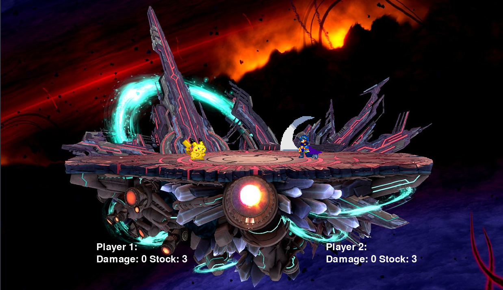

Welcome to PySmash, a Pygame implementation of Super Smash Bros!

{:.lead width="800" height="465" loading="lazy"}

Playable as a local multiplayer game on one computer or over a local network, our game features
- A custom physics engine for smooth and consistent motion
- Under the hood mathmematics authentic to Nintendo's version of the game
- Robust model, view, controller based architecture designed for easy expandability and maximum versatility

# Video Demo

# Full Project Presentation

## External Resources
Menu screens adapted from [https://www.geeksforgeeks.org/creating-start-menu-in-pygame/](https://www.geeksforgeeks.org/creating-start-menu-in-pygame/)

Spritesheet Class from [www.scriptefun.com/transcript-2-using-sprite-sheets-and-drawing-the-background](www.scriptefun.com/transcript-2-using-sprite-sheets-and-drawing-the-background)

Sprites from [www.scriptefun.com/transcript-2-using-sprite-sheets-and-drawing-the-background](https://www.spriters-resource.com/custom_edited/supersmashbroscustoms/)

 
 

